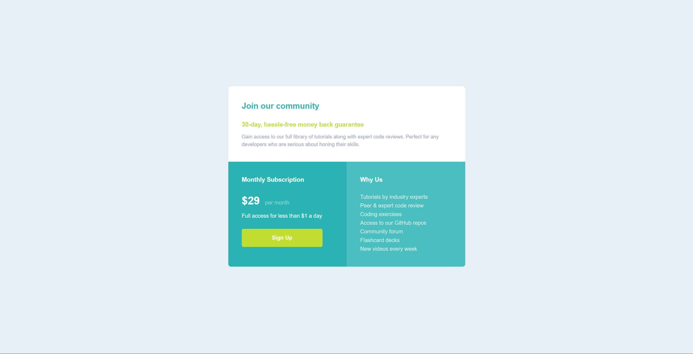

# Frontend Mentor - Single price grid component solution

This is a solution to the [Single price grid component challenge on Frontend Mentor](https://www.frontendmentor.io/challenges/single-price-grid-component-5ce41129d0ff452fec5abbbc). Frontend Mentor challenges help you improve your coding skills by building realistic projects. 

## Table of contents

- [Overview](#overview)
  - [The challenge](#the-challenge)
  - [Screenshot](#screenshot)
  - [Links](#links)
- [My process](#my-process)
  - [Built with](#built-with)
  - [What I learned](#what-i-learned)
  - [Useful resources](#useful-resources)
- [Author](#author)

**Note: Delete this note and update the table of contents based on what sections you keep.**

## Overview

### The challenge

Users should be able to:

- View the optimal layout for the component depending on their device's screen size
- See a hover state on desktop for the Sign Up call-to-action

### Screenshot

### Links

- Solution URL: [Solution URL](https://www.frontendmentor.io/solutions/single-price-grid-component-tzLv6UUEer)
- Live Site URL: [Live site URL](https://single-price-grid-component-tedkata.vercel.app/)

## My process

### Built with

- Semantic HTML5 markup
- CSS custom properties
- Flexbox
- CSS Grid
 

### What I learned
This challenge has helped me learn how to work with grid.

### Useful resources
- [CodeCademy Cheatsheet](https://www.codecademy.com/resources/cheatsheets/language/html-css) - This cheatsheat can help you remember things you might have forgot. We are humans, we forget stuff.

## Author
- Frontend Mentor - [@tedkataa](https://www.frontendmentor.io/profile/tedkataa)
- Twitter - [@tedkataa_](https://x.com/tedkataa_)